# ELearn Recruitment System — Deep-Dive Explanation

> A plain-language walkthrough of how the system is put together, what happens
> inside it when a user clicks a button, and *why* it is designed the way it is.
>
> The diagrams are written in [Mermaid](https://mermaid.js.org/) — they render
> automatically in GitHub, GitLab, VS Code, Cursor, and most modern Markdown
> viewers. If your viewer doesn't render them, each diagram is accompanied by
> an ASCII equivalent.

---

## Table of contents

1. [The big picture](#1-the-big-picture)
2. [Architecture at a glance](#2-architecture-at-a-glance)
3. [Tech stack and why each piece was chosen](#3-tech-stack-and-why-each-piece-was-chosen)
4. [Data model](#4-data-model)
5. [User journeys](#5-user-journeys)
6. [Authentication — how login actually works](#6-authentication--how-login-actually-works)
7. [Resume upload and parsing — what happens when a PDF hits the server](#7-resume-upload-and-parsing--what-happens-when-a-pdf-hits-the-server)
8. [The matching engine — the heart of the system](#8-the-matching-engine--the-heart-of-the-system)
9. [Applying to a job](#9-applying-to-a-job)
10. [Admin pipeline management](#10-admin-pipeline-management)
11. [PDF report generation](#11-pdf-report-generation)
12. [Admin analytics](#12-admin-analytics)
13. [Security model](#13-security-model)
14. [Performance and scaling notes](#14-performance-and-scaling-notes)
15. [Glossary](#15-glossary)

---

## 1. The big picture

**ELearn Recruitment** is a two-sided platform:

- **Candidates** create an account, fill in a profile, upload a resume, browse jobs, see ML-powered match scores, and apply.
- **Admins** (recruiters/HR) post jobs, review applications through a pipeline, use a "match explorer" that ranks candidates by a job, and export PDF reports.

The thing that makes it different from a plain job board is the **matching engine**. Instead of matching on keywords alone ("show me resumes containing `Python`"), the system combines four different kinds of similarity into a single 0–100% score:

| Signal              | What it catches                                                         | Weight |
| ------------------- | ----------------------------------------------------------------------- | ------ |
| Skill coverage      | "Does this candidate have the skills the job actually requires?"        | 0.45   |
| Experience fit      | "Are they in the right experience window for this role?"                | 0.15   |
| Semantic similarity | "Does their background *sound like* the kind of person this job wants?" | 0.25   |
| Keyword overlap     | "How many shared vocabulary words appear in both documents?"            | 0.15   |

The semantic signal is the clever one — it uses a pretrained neural network (Sentence-BERT) to turn the resume and the job description into numeric vectors, and then measures the angle between them. This is the "feature learning" piece: we don't hand-engineer features, we let a model that was already trained on billions of sentences do the heavy lifting.

---

## 2. Architecture at a glance

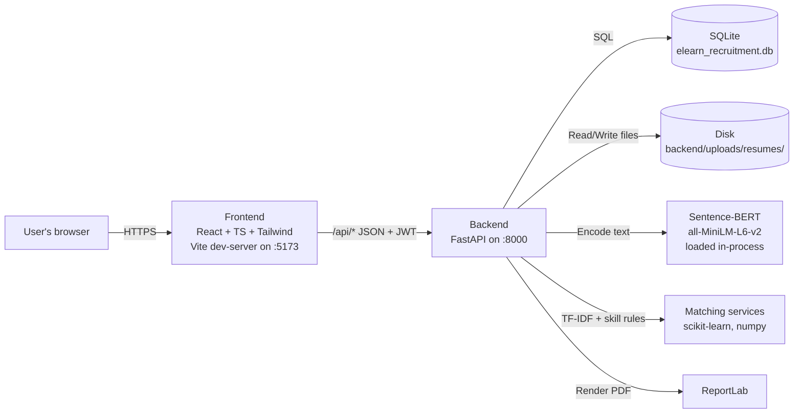

**ASCII fallback:**

```text
  Browser
     |
     | HTTPS
     v
  Frontend (React/Vite :5173)
     |
     | JSON + JWT over /api/*
     v
  Backend (FastAPI :8000)
     |           \\
     |            \\-- Sentence-BERT (in-process)
     |             \\-- scikit-learn (TF-IDF)
     |              \\-- ReportLab (PDFs)
     v
  SQLite DB + uploads/ folder on disk
```

### Why this shape?

- **Two-tier, one box** — There's no separate "ML service", no message queue, no Redis, no Celery. The ML model lives inside the FastAPI process because the model is small (~80 MB) and fast enough (<50 ms per match). This keeps the system tiny to install and reason about.
- **SQLite for demo, Postgres for prod** — SQLite means "zero install". When you outgrow single-box deployment, flip `DATABASE_URL` to a PostgreSQL URL and everything keeps working because we use SQLAlchemy's engine abstraction.
- **Frontend talks only to `/api/*`** — In dev, Vite proxies it to `:8000`. In prod, Nginx serves the built static bundle and reverse-proxies `/api/*` to the backend. No CORS headaches either way.

---

## 3. Tech stack and why each piece was chosen

### Backend

| Choice               | Why                                                                                   |
| -------------------- | ------------------------------------------------------------------------------------- |
| **FastAPI**          | Type-annotated, auto-generates `/docs`, async-ready, Pydantic built-in validation.    |
| **SQLAlchemy 2.x**   | Industry-standard ORM with a strict `Mapped[...]` typing model. Works with any DB.    |
| **Pydantic 2.x**     | Validates all inputs at the API boundary (Secure Python rule: sanitize external data).|
| **bcrypt**           | Industry-standard password hashing. `bcrypt.checkpw` is constant-time (timing-safe).  |
| **PyJWT**            | Stateless token auth. No server-side session store needed.                            |
| **pdfplumber**       | Good text extraction from PDFs without pulling in a full office suite.                |
| **python-docx**      | Reads `.docx` by directly parsing the OOXML zip — no dependency on Word.              |
| **scikit-learn**     | TF-IDF, cosine similarity, proven and fast.                                           |
| **sentence-transformers** | Wraps Hugging Face for the `all-MiniLM-L6-v2` model — small (80 MB), fast, strong.|
| **ReportLab**        | Generates PDFs entirely in Python, no LaTeX or headless browser required.             |

### Frontend

| Choice               | Why                                                                                   |
| -------------------- | ------------------------------------------------------------------------------------- |
| **React 18 + TS**    | Type safety end-to-end, huge ecosystem.                                               |
| **Vite**             | Sub-second cold-boot dev server, instant HMR.                                         |
| **Tailwind CSS**     | Utility-first, no CSS architecture debates; fast to iterate.                          |
| **React Router**     | Client-side routing with nested layouts.                                              |
| **Zustand**          | 1 KB auth store. No boilerplate like Redux.                                           |
| **Axios**            | Sane default for HTTP + interceptors for auth headers and 401 redirects.              |
| **Recharts**         | Declarative charts built on SVG + D3.                                                 |
| **lucide-react**     | Clean, consistent icon set.                                                           |

---

## 4. Data model

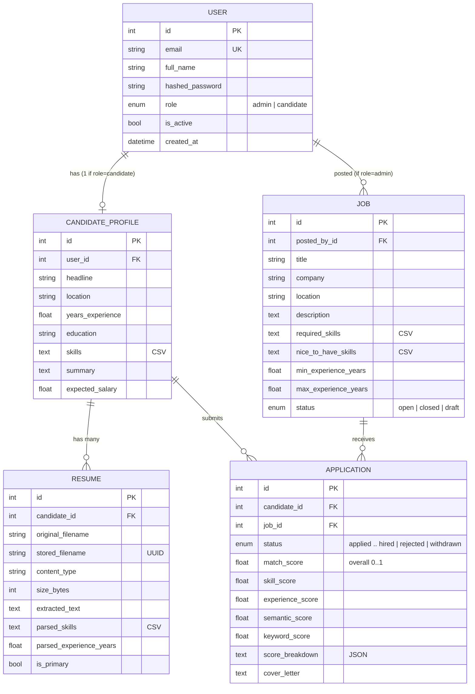

### Things worth calling out

- **Skills are CSV text, not a join table.** That's a deliberate simplicity choice. For an MVP with ~thousands of candidates, querying `LIKE '%python%'` on a small Text column is fine. If you hit 100k candidates or want strict skill analytics, migrate to a `skills` table + `candidate_skills` many-to-many.
- **`Application` caches the match score at apply-time.** This is important: matching is relatively expensive (~30 ms), but the admin list view needs to show hundreds of apps at once. So we compute once on submit, store the result, and let admins filter/sort on cached columns. The match explorer page recomputes on demand because it's a smaller, ad-hoc view.
- **`Resume.stored_filename` is a UUID, not the original name.** Never trust client-supplied filenames as paths — see [Security model](#13-security-model).

---

## 5. User journeys

### Candidate flow

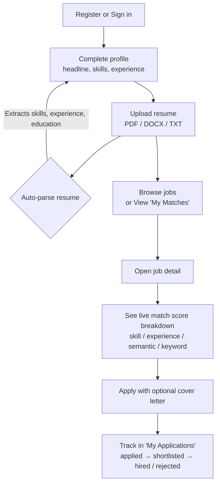

### Admin flow

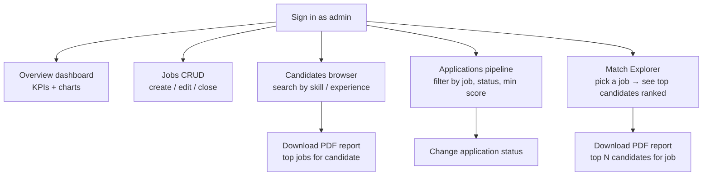

---

## 6. Authentication — how login actually works

We use **stateless JWT** auth. No server-side session store. The server only needs its `SECRET_KEY` to verify tokens.

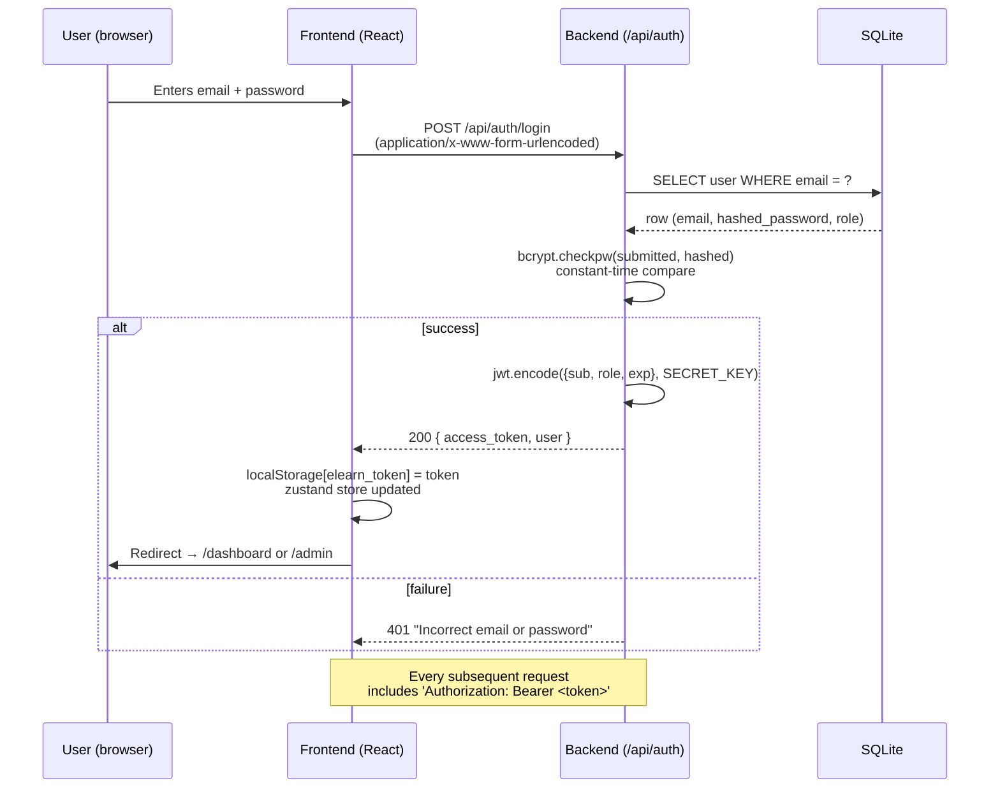

### What's inside a token?

```json
{
  "sub": "42",           // user id (string)
  "role": "candidate",
  "exp": 1735000000,     // unix timestamp, 24h from issue
  "iat": 1734913600
}
```

Signed with HS256 using `SECRET_KEY` from your `.env`. If anyone tampers with any field, the signature won't verify, and the request is rejected with 401.

### Role-based access control

On every protected endpoint, FastAPI runs these dependencies:

```text
get_current_user(token) → User object
require_admin(user)     → 403 if user.role != admin
require_candidate(user) → 403 if user.role != candidate
```

That's the *only* gate between the world and the DB. The frontend also gates based on role, but we never trust the frontend — the backend is the source of truth.

---

## 7. Resume upload and parsing — what happens when a PDF hits the server

This is the most security-sensitive path in the system (accepts arbitrary files from users), so a lot of care goes into it.

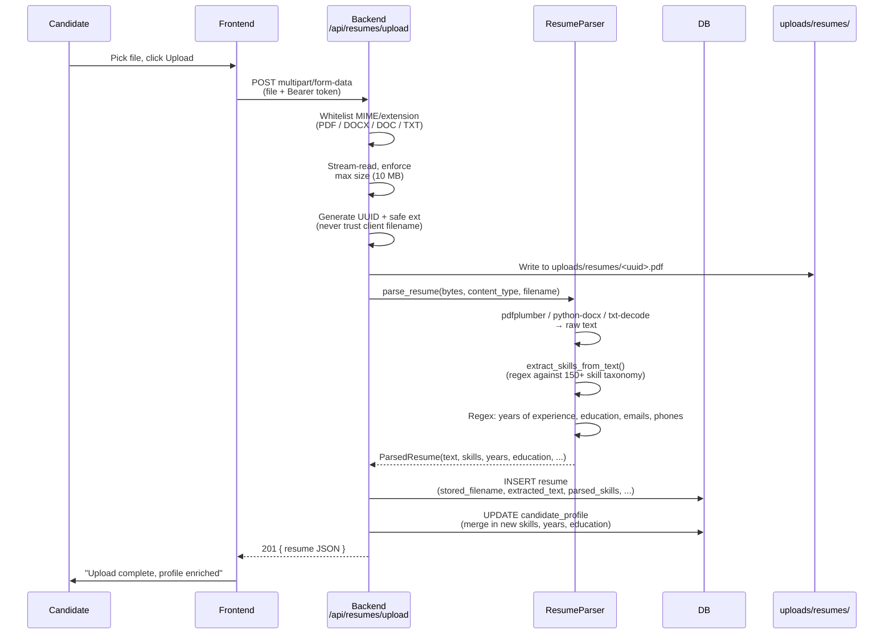

### The parser in plain words

Given the raw bytes of a resume, the parser does four things:

1. **Reach the text** — Dispatches by MIME type (or extension) to `pdfplumber`, `python-docx`, or plain-text decoding. If any of those fail, we log a warning and return empty text instead of blowing up.
2. **Find the skills** — We pre-built a taxonomy of ~150 canonical skills (`Python`, `React`, `Kubernetes`, …). We compile a single big regex that matches any of them as whole words, longest-first. So `React.js` matches before `React`, and `scikit-learn` matches before `learn`. Then we canonicalize aliases (`psql` → `PostgreSQL`, `k8s` → `Kubernetes`, etc.).
3. **Find the numbers** — A short list of regexes hunts for `N years of experience`, `Experience: N yrs`, `over N years`. We take the max plausible match.
4. **Find the credentials** — Another set of regexes picks out the first education mention (`B.Tech …`, `Master's …`, `PhD …`) and any emails / phone numbers.

### Why not use spaCy / NER?

Tried-and-true NER is great for free-form text, but it's ~200 MB of model weights and a bit unpredictable on resume-style content (lots of short bulleted lines). A curated taxonomy + regex is smaller, faster, and — crucially — predictable. You can see exactly why a skill was picked up.

### Safety rails

- Client-supplied `filename` is **never** used as a file path. We take only its extension after whitelisting.
- The on-disk name is a random UUID, so two candidates with identical filenames never collide.
- Every path is resolved under a base directory and verified with `safe_resume_path()` — defense against directory traversal.

---

## 8. The matching engine — the heart of the system

This is where the "ML" in "ML-powered recruitment" actually happens. Let me walk through it signal-by-signal, then show how they combine.

### Inputs

Before anything is compared, both sides are turned into **feature bundles**:

**Candidate feature bundle** (from `build_candidate_features`):
- `skills`: list of canonical skill names, taken from the profile (and augmented from the resume).
- `years_experience`: a float.
- `text`: headline + summary + skills list + extracted resume text, joined into one blob.

**Job feature bundle** (from `build_job_features`):
- `required_skills`, `nice_to_have_skills`: lists.
- `min_experience`, `max_experience`: floats (max is optional).
- `text`: title + description + responsibilities + "Required: …" + "Nice to have: …", joined.

### Signal #1 — Skill score (weight 0.45)

This is the most important signal because it's the most controllable by a candidate. It's essentially a weighted Jaccard:

```text
matched_required   = candidate_skills ∩ required_skills
missing_required   = required_skills   − candidate_skills
matched_nice       = candidate_skills ∩ nice_to_have

base               = |matched_required| / |required|
bonus              = 0.15 × (|matched_nice| / |nice_to_have|)    (capped)

skill_score        = min(1.0, base + bonus)
```

- If the job requires 5 skills and the candidate has 4 of them → `base = 0.8`.
- If they also have 2 of the 3 nice-to-haves → `bonus ≈ 0.10`.
- Final skill score ≈ `0.90`.

This scheme has three nice properties:

1. It's explainable — we can show a candidate *which* skills matched and which are missing.
2. It's bounded at 1.0 so you can never "game" it by listing 200 skills.
3. Nice-to-haves genuinely help you, but can't rescue a candidate who's missing all the required skills.

### Signal #2 — Experience score (weight 0.15)

We don't want a sharp cutoff at `min_experience` (that would reject a 2.9-year candidate for a "3-year minimum" role). Instead:

```text
if years in [min, max]:           return 1.0
if years < min:                   return max(0, 1.0 − 0.15 × (min − years))
if years > max:                   return max(0.5, 1.0 − 0.05 × (years − max))
```

- Under-qualified: ~15% penalty per missing year.
- Over-qualified: ~5% penalty per excess year, floored at 0.5 (we don't punish seniority much).

### Signal #3 — Semantic similarity (weight 0.25)

This is the "feature learning" piece. The pretrained model **`all-MiniLM-L6-v2`** from Sentence-BERT takes any sentence (or paragraph) and turns it into a 384-dimensional vector. Two texts that *mean* similar things end up with vectors pointing in nearly the same direction, even if they share almost no words.

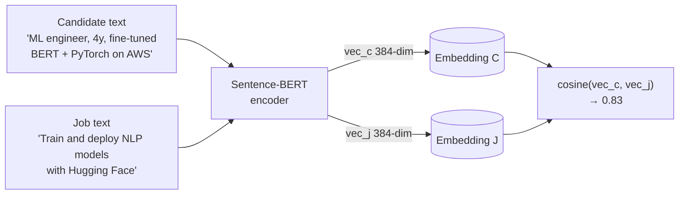

Why this matters: a candidate who writes `"fine-tuned transformers for document classification"` and a job that says `"train NLP models for doc understanding"` share almost **no** keywords, yet semantically they're the same thing. The cosine similarity catches that. Skill-matching and TF-IDF would miss it entirely.

**Graceful fallback.** The first request lazily loads the model (~80 MB from disk, or downloads it if missing). If loading fails (no internet on first run, disk full, etc.), the module silently falls back to TF-IDF in place of the semantic signal. The system never crashes just because the model isn't there — it just gets slightly less smart.

### Signal #4 — Keyword overlap (weight 0.15)

Old-school but still useful: TF-IDF cosine similarity over 1-to-2-gram tokens with English stopwords removed. This catches exact jargon matches that embeddings sometimes smooth over.

We keep it at a low weight (0.15) because it tends to reward keyword-stuffing. But it's a good sanity check — if your TF-IDF is near zero, the resume literally shares no vocabulary with the job, which is a real signal.

### Putting it together

```text
overall = 0.45 × skill
        + 0.15 × experience
        + 0.25 × semantic
        + 0.15 × keyword
```

The weights are fixed constants in `matching_service.py`. They're tuneable — if you collect real hire/no-hire outcome data later, you could fit these weights with logistic regression. For now the mixture is hand-set to reflect:

> "Skills are the floor. Semantics distinguishes equivalent-skill candidates. Experience is a bounded correction. Keywords break ties."

### End-to-end scoring diagram

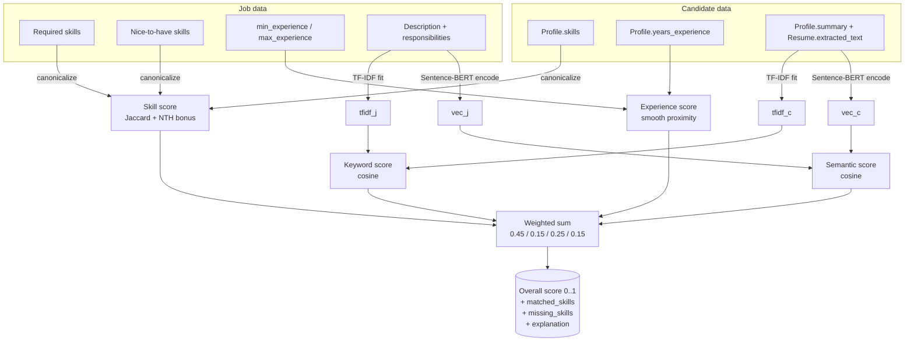

---

## 9. Applying to a job

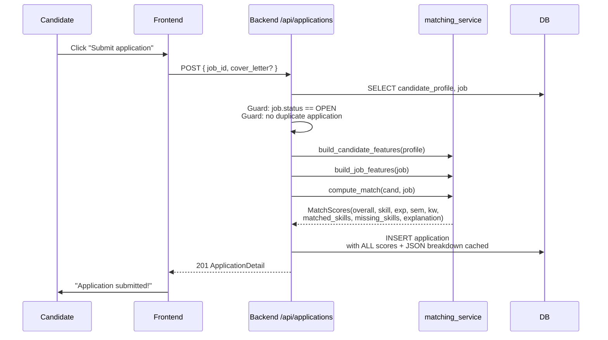

After this point, admins see this application in their list with the pre-computed score, and can sort/filter by it without recomputing. That's why the application row has six score columns — they're a frozen snapshot of the match at application time.

---

## 10. Admin pipeline management

Every application moves through a Kanban-style status machine:

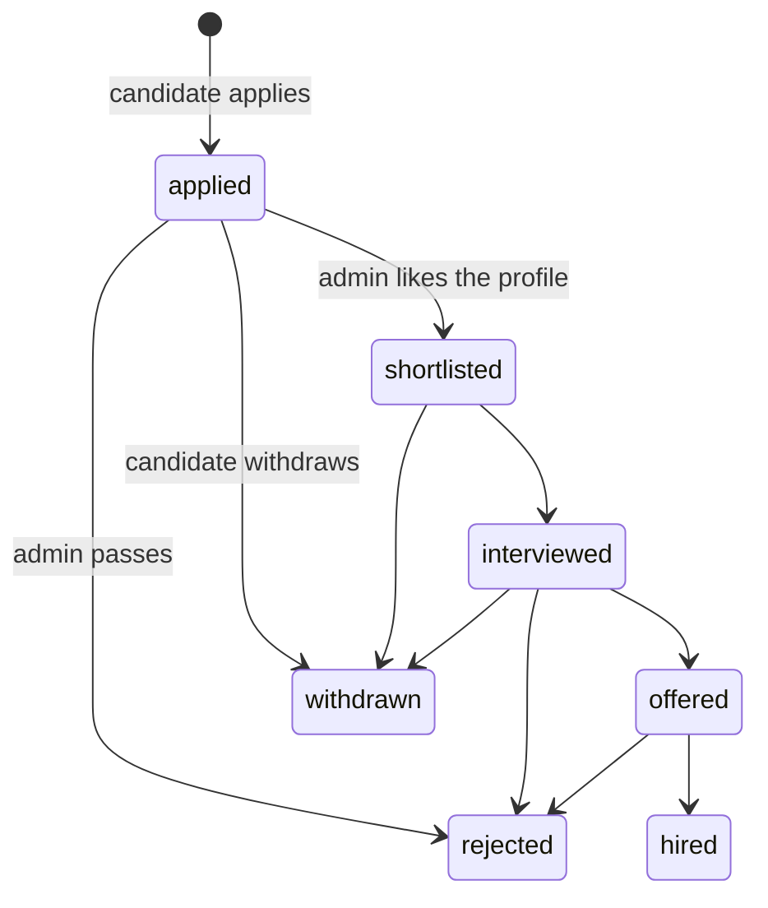

The admin Applications page is just a table where the "Status" column is a `<select>` bound to `PATCH /api/applications/{id}/status`. No fancy drag-and-drop — it's deliberately boring and fast.

The admin *Overview* page turns these transitions into the "Application status funnel" chart, so you can see how candidates move through the pipeline over time.

---

## 11. PDF report generation

Two kinds of reports, both generated in-process with ReportLab:

### Per-job report (`/api/reports/job/{id}.pdf`)

Answers: *"Of all our candidates, who are the top 20 for this role?"*

1. Load job → build job features.
2. Iterate all candidate profiles → build candidate features.
3. Score each, sort desc, take top 20.
4. Render a PDF with: header (title, company, required skills) + ranked table (candidate, email, years, overall %, skill %, top matched skills).

### Per-candidate report (`/api/reports/candidate/{id}.pdf`)

Answers: *"Given this candidate, which of our open jobs fit them best?"*

Symmetric to the above: score the candidate against every `OPEN` job, sort, render table.

Both endpoints stream the PDF as an attachment with a sanitized filename (`match_report_<name>.pdf`). No temp files on disk — it's all in-memory.

---

## 12. Admin analytics

The `/api/admin/overview` endpoint is a single aggregation call that populates the admin dashboard:

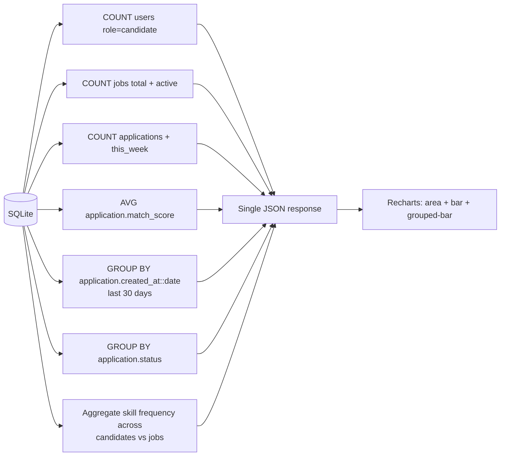

All queries are fast because:

- Candidate/Job counts are just `COUNT(*)`.
- Application aggregations go through indexed FKs.
- Top-skills is computed in Python after a single `SELECT skills FROM candidate_profiles` — a few hundred rows, a few milliseconds.

If the DB ever gets big enough that this page is slow, the obvious move is materialized views or a nightly batch job populating a `dashboard_stats` table. Not needed today.

---

## 13. Security model

All the following rules are actively enforced in code (see `backend/app/core/security.py`, `backend/app/routers/resumes.py`, `backend/app/services/resume_parser.py`):

| Concern                           | How it's handled                                                                |
| --------------------------------- | ------------------------------------------------------------------------------- |
| Secret management                 | `SECRET_KEY`, DB URL come from `.env` via `pydantic-settings`. None hardcoded.  |
| Password storage                  | bcrypt with 12 rounds of salt. Verification via `bcrypt.checkpw` (constant-time).|
| JWT                               | HS256, short-ish expiry (24 h default), `exp` claim enforced on every request.  |
| Authorization                     | FastAPI dependencies: `require_admin` / `require_candidate` at every protected endpoint. |
| Input validation                  | Pydantic schemas at the API boundary — nothing reaches the DB unvalidated.      |
| SQL injection                     | SQLAlchemy parameterized queries, no raw SQL concatenation anywhere.            |
| File upload — type                | MIME + extension whitelist: PDF, DOCX, DOC, TXT.                                |
| File upload — size                | Streamed in 64 KB chunks, aborted over `MAX_UPLOAD_SIZE_MB`.                    |
| File upload — naming              | Server-generated UUID name. `basename()` on client filename, extension only.    |
| File upload — paths               | `safe_resume_path()` verifies resolved path is still under upload dir.          |
| File download — authz             | Candidate: own resumes only. Admin: any resume.                                 |
| CORS                              | Whitelist of origins from `.env`. Wildcard never used.                          |
| No `eval` / `exec` / `pickle`     | Grep-verified. All data interchange uses JSON or Pydantic.                      |
| HTTPS                             | Expected to be terminated by reverse proxy in production; dev is HTTP on localhost.|
| Timing attacks                    | Login returns one generic "Incorrect email or password" regardless of failure type.|

---

## 14. Performance and scaling notes

### Today's limits (rough, on a single modest laptop)

| Operation                                | Time           |
| ---------------------------------------- | -------------- |
| Login                                    | ~40 ms (bcrypt)|
| Job list (50 rows, 200 apps)             | ~20 ms         |
| Resume upload + parse (300 KB PDF)       | ~200 ms        |
| Single match score                       | ~30 ms (with BERT) / ~5 ms (fallback) |
| Match explorer: 1 job × 50 candidates    | ~1.5 s (first), ~0.4 s (warm) |
| Admin overview (50 cands, 20 jobs, 127 apps) | ~80 ms         |

### Where it'll break first and how to fix

| Bottleneck                  | Breaks at           | Mitigation                                                                           |
| --------------------------- | ------------------- | ------------------------------------------------------------------------------------ |
| BERT inference on big lists | ~500 candidates     | Precompute + cache candidate embeddings in a `candidate_embeddings` table. Only need to recompute when profile/resume changes. |
| SQLite writes under load    | ~50 concurrent users| Switch to PostgreSQL; SQLAlchemy engine URL is all that changes.                     |
| `uploads/` on disk          | 100s of GB          | Move to S3 (boto3). The download endpoint becomes a presigned URL redirect.          |
| Single uvicorn process      | CPU-bound during matching | `uvicorn --workers N` or `gunicorn -k uvicorn.workers.UvicornWorker -w N`.     |
| Cold-start of BERT model    | Every server restart | Eager-load in the `lifespan` startup hook (we already do best-effort).              |

### Feature weights aren't sacred

Today the 0.45 / 0.15 / 0.25 / 0.15 split is hand-tuned. Once you have real hire/no-hire labels, you can replace the weighted sum with a tiny logistic regression or gradient-boosting model. Keep each signal as a feature — they're all bounded in [0, 1], they compose well.

---

## 15. Glossary

- **Canonical skill** — the normalized form of a skill name (e.g. `k8s` → `Kubernetes`).
- **Cosine similarity** — the cosine of the angle between two vectors; 1.0 = identical direction, 0.0 = orthogonal. We use it on both TF-IDF vectors and BERT embeddings.
- **Embedding** — a fixed-size numeric vector representation of a piece of text.
- **Feature learning** — letting the model learn its own representation from data, instead of hand-engineering features. The Sentence-BERT signal is the feature-learning part of this system.
- **Hybrid matching** — combining multiple scoring signals (structured rules + ML) into one score.
- **Jaccard index** — \| A ∩ B \| / \| A ∪ B \| — proportion of shared items out of total unique items.
- **JWT** — JSON Web Token. Self-describing, cryptographically-signed token for stateless auth.
- **Sentence-BERT** — a family of transformer models fine-tuned for producing sentence-level embeddings that work well with cosine similarity.
- **TF-IDF** — Term Frequency × Inverse Document Frequency. A classical way to weight words by how "characterful" they are within a corpus.

---

### Appendix: where to read each piece of code

| Topic                             | File                                                      |
| --------------------------------- | --------------------------------------------------------- |
| Auth + JWT                        | `backend/app/core/security.py`, `backend/app/routers/auth.py` |
| Role-based access                 | `backend/app/core/deps.py`                                |
| Data model                        | `backend/app/models/*.py`                                 |
| Input validation                  | `backend/app/schemas/*.py`                                |
| Resume parsing                    | `backend/app/services/resume_parser.py`, `skill_taxonomy.py` |
| **Matching engine (the ML core)** | `backend/app/services/matching_service.py`                |
| PDF reports                       | `backend/app/services/report_service.py`                  |
| Admin analytics                   | `backend/app/routers/admin.py`                            |
| Seed data                         | `backend/app/seed.py`                                     |
| Frontend routing                  | `frontend/src/App.tsx`                                    |
| API client (axios + interceptors) | `frontend/src/api/client.ts`, `endpoints.ts`              |
| Admin overview charts             | `frontend/src/pages/admin/Overview.tsx`                   |
| Candidate match view              | `frontend/src/pages/candidate/Matches.tsx`                |
